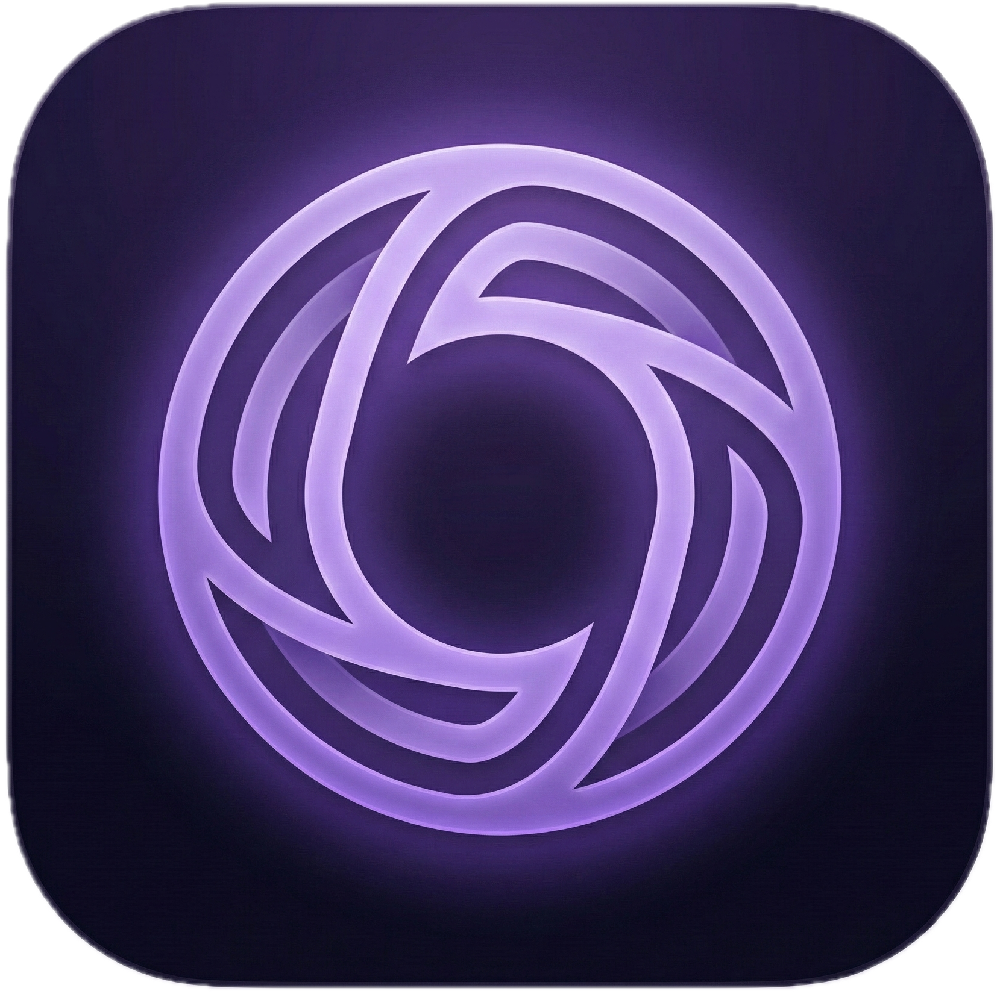

# Balance

<p align="left">
  
</p>

**Balance** is an offline-first personal finance app built with React Native and Expo.  
All data stays on-device: no cloud, no accounts, no tracking.

## Highlights
- **Offline-first**: local data, always available.
- **Privacy**: no servers, no profiles, no tracking.
- **Snapshots & KPIs**: net worth over time.
- **Cash Flow**: recurring income/expense overview.
- **Categories**: spending by category and quick filters.
- **Multi-language**: IT/EN/PT.

## Core features
- **Multiple wallets** with colors and currency.
- **Recurring entries** for income/expenses.
- **Monthly snapshots** to track net worth.
- **Charts** for trends and distribution.
- **Data export/import** in JSON.

## Quick start
```bash
npm install
npm run start
```

Useful commands:
- iOS: `npm run ios`
- Android: `npm run android`
- Web: `npm run web`

## Project structure
- `src/app` → navigation entrypoint
- `src/ui` → UI and components
- `src/db` → local storage (SQLite)
- `src/i18n` → translations
- `docs` → project notes

## Localization
Translations live in `src/i18n/locales/{it,en,pt}.json`.  
When adding new copy, update **all** locale files.

## Contributing
See `CONTRIBUTING.md`.

## License
This project is licensed under **AGPL-3.0-only**.  
See `LICENSE`.

**Branding note**: the Balance name, logo, and brand assets are not licensed for reuse without permission.
